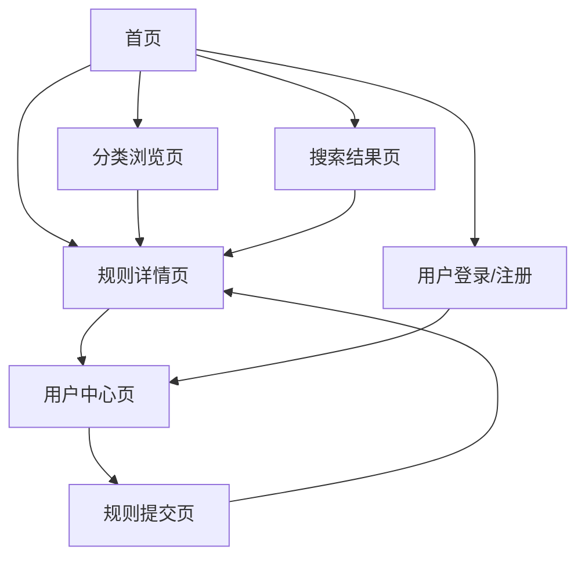

# 全球 Rules 知识库产品需求文档

## 1. Product Overview

全球 Rules 知识库是一个汇聚世界各地开发者智慧的综合性技术规则资源平台。我们致力于收集、整理和分享来自全球开发者社区的最佳 Rules 实践，为全世界的开发者提供高质量、实用的 AI 编程助手配置规则。

该平台面向全球所有层次的开发者，从初学者到资深工程师，汇聚涵盖各种编程语言、框架和工具的 Rules 规则库。通过智能搜索和分类浏览功能，让全球开发者能够快速找到适合自己项目的最佳实践规则，提升 AI 辅助编程的效率和代码质量。

## 2. Core Features

### 2.1 User Roles

| Role | Registration Method | Core Permissions |
|------|---------------------|------------------|
| 访客用户 | 无需注册 | 可浏览所有规则内容、使用搜索功能 |
| 注册用户 | 邮箱注册 | 可收藏规则、提交新规则、评论和评分 |
| 管理员 | 内部邀请 | 可审核规则、管理分类、用户管理 |

### 2.2 Feature Module

我们的全球 Rules 知识库包含以下主要页面：

1. **首页**: 英雄区块、导航菜单、全球热门规则展示、技术栈分类快速入口、智能搜索框、最新全球贡献内容
2. **分类浏览页**: 全球技术栈分类列表、分类统计信息、子分类导航、规则列表展示、贡献者地区分布
3. **规则详情页**: 完整 Rules 内容、使用示例、相关规则推荐、全球用户评论、收藏功能、贡献者信息
4. **搜索结果页**: 全球搜索结果列表、关键词高亮、多维度筛选器、智能排序选项
5. **用户中心页**: 个人信息、收藏列表、贡献历史、全球排名、设置选项
6. **规则提交页**: Rules 编辑器、技术栈分类选择、实时预览功能、全球审核提交

### 2.3 Page Details

| Page Name | Module Name | Feature description |
|-----------|-------------|---------------------|
| 首页 | 英雄区块 | 展示全球 Rules 知识库标语和核心价值，突出全球化特色和 AI 编程助手定位 |
| 首页 | 导航菜单 | 提供主要页面导航，包含全球分类、智能搜索、用户中心、贡献排行等入口 |
| 首页 | 全球热门规则展示 | 展示全球最受欢迎的 Rules 卡片，包含标题、描述、技术标签、贡献者信息 |
| 首页 | 技术栈分类快速入口 | 展示主要编程语言和框架分类图标，支持快速跳转到对应 Rules |
| 首页 | 智能搜索框 | 全局 Rules 搜索入口，支持关键词搜索、技术栈筛选和智能提示 |
| 首页 | 最新全球贡献 | 展示最近来自全球开发者贡献的 Rules 列表，包含贡献者地区标识 |
| 分类浏览页 | 分类导航 | 展示编程语言和框架的 Rules 分类树形结构，支持多级技术栈浏览 |
| 分类浏览页 | 统计信息 | 显示当前分类下的 Rules 数量、全球贡献者统计和子分类信息 |
| 分类浏览页 | 规则列表 | 展示分类下的 Rules 卡片，包含标题、描述、技术标签、全球热度、贡献者 |
| 分类浏览页 | 筛选排序 | 提供按全球热度、贡献时间、评分、贡献者地区等维度的筛选和排序功能 |
| 规则详情页 | 规则内容 | 展示完整的规则文档，支持Markdown渲染和代码高亮 |
| 规则详情页 | 代码示例 | 展示相关代码示例，支持语法高亮和复制功能 |
| 规则详情页 | 相关推荐 | 推荐相关技术栈的规则，基于标签和内容相似度 |
| 规则详情页 | 用户互动 | 提供收藏、评分、评论功能，需要用户登录 |
| 搜索结果页 | 结果列表 | 展示搜索结果，包含关键词高亮和相关度排序 |
| 搜索结果页 | 筛选器 | 提供按技术栈、类型、时间等维度的筛选选项 |
| 搜索结果页 | 排序选项 | 支持按相关度、热度、时间等维度排序 |
| 用户中心页 | 个人信息 | 显示和编辑用户基本信息，包含头像、昵称等 |
| 用户中心页 | 收藏列表 | 展示用户收藏的规则列表，支持分类管理 |
| 用户中心页 | 提交历史 | 显示用户提交的规则和审核状态 |
| 规则提交页 | 编辑器 | 提供Markdown编辑器，支持实时预览和语法高亮 |
| 规则提交页 | 分类选择 | 选择规则所属的技术栈分类和子分类 |
| 规则提交页 | 标签管理 | 添加和管理规则标签，支持自定义和推荐标签 |
| 规则提交页 | 预览提交 | 预览规则最终效果，确认后提交审核 |

## 3. Core Process

### 访客用户流程
访客用户可以直接访问首页，通过分类浏览或搜索功能查找所需的技术规则。点击规则卡片进入详情页查看完整内容，包括代码示例和相关推荐。如需收藏或评论功能，系统会引导用户进行注册。

### 注册用户流程
注册用户登录后可以使用完整功能，包括收藏喜欢的规则、对规则进行评分和评论、提交新的规则内容。在用户中心可以管理个人信息、查看收藏列表和提交历史。

### 管理员流程
管理员可以审核用户提交的规则内容，管理技术栈分类结构，处理用户反馈和举报，维护平台内容质量。

## 4. User Interface Design

### 4.1 Design Style

- **主色调**: 深蓝色 (#1e40af) 和亮蓝色 (#3b82f6)，体现专业和技术感
- **辅助色**: 灰色系 (#6b7280, #f3f4f6) 用于背景和文本
- **强调色**: 绿色 (#10b981) 用于成功状态，红色 (#ef4444) 用于错误提示
- **按钮样式**: 圆角设计 (rounded-lg)，支持悬停和点击效果
- **字体**: 系统默认字体栈，代码使用等宽字体 (font-mono)
- **字体大小**: 标题 text-2xl/3xl，正文 text-base，小字 text-sm
- **布局风格**: 卡片式设计，顶部导航栏，响应式网格布局
- **图标风格**: 使用 Lucide React 图标库，简洁线性风格

### 4.2 Page Design Overview

| Page Name | Module Name | UI Elements |
|-----------|-------------|-------------|
| 首页 | 英雄区块 | 大标题 (text-4xl font-bold)，副标题 (text-xl text-gray-600)，渐变背景，CTA按钮 (bg-blue-600 hover:bg-blue-700) |
| 首页 | 导航菜单 | 固定顶部导航 (sticky top-0)，白色背景，阴影效果，Logo和菜单项水平排列 |
| 首页 | 热门规则展示 | 3列网格布局 (grid-cols-3)，卡片设计 (bg-white rounded-lg shadow)，悬停效果 |
| 首页 | 分类快速入口 | 6列网格 (grid-cols-6)，圆形图标背景，技术栈名称，悬停放大效果 |
| 分类浏览页 | 分类导航 | 左侧边栏 (w-64)，树形结构，可折叠分类，当前选中高亮 |
| 分类浏览页 | 规则列表 | 右侧主内容区，卡片列表，每行2-3个卡片，分页导航 |
| 规则详情页 | 规则内容 | 单列布局，Markdown渲染，代码块语法高亮，目录导航 |
| 规则详情页 | 相关推荐 | 底部推荐区域，横向滚动卡片，相似度标识 |
| 搜索结果页 | 筛选器 | 左侧筛选面板，复选框和下拉选择，实时筛选 |
| 搜索结果页 | 结果列表 | 右侧结果区域，列表式布局，关键词高亮 (bg-yellow-200) |
| 用户中心页 | 导航标签 | 顶部标签导航，个人信息、收藏、提交历史等标签页 |
| 规则提交页 | 编辑器 | 左右分栏布局，左侧Markdown编辑器，右侧实时预览 |

### 4.3 Responsiveness

该产品采用桌面优先的响应式设计，在移动端进行适配优化。主要断点为 sm (640px)、md (768px)、lg (1024px)、xl (1280px)。移动端将侧边栏改为抽屉式导航，网格布局调整为单列或双列，优化触摸交互体验。