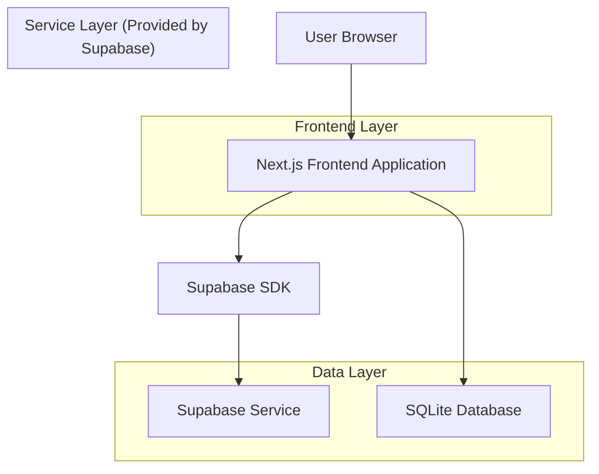
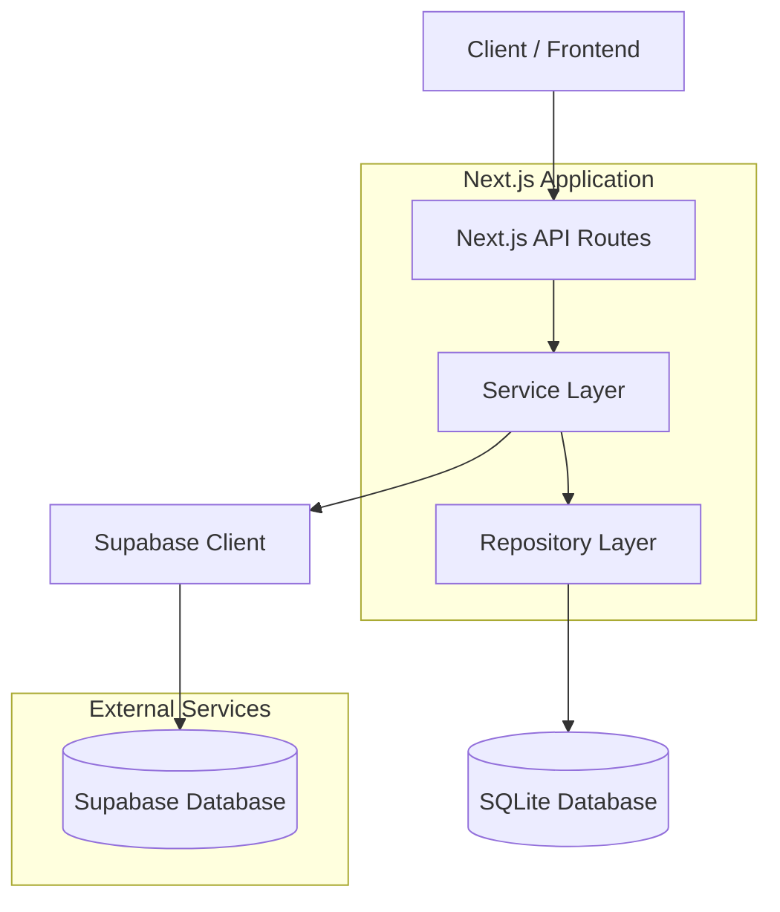
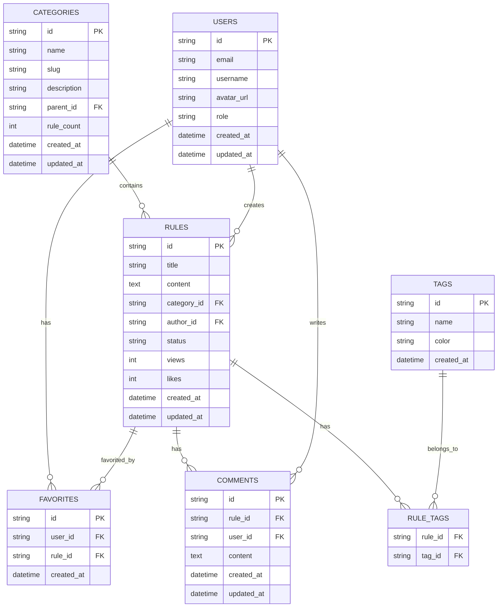

# 全球 Rules 知识库技术架构文档

## 1. Architecture design



## 2. Technology Description

- Frontend: Next.js@14 + TypeScript + Tailwind CSS + Lucide React
- Database: SQLite (better-sqlite3) + Supabase (用户认证)
- Package Manager: pnpm
- Code Quality: ESLint + Prettier

## 3. Route definitions

| Route | Purpose |
|-------|---------|
| / | 首页，展示全球热门规则、技术栈分类入口和智能搜索功能 |
| /categories | 分类浏览页，展示所有编程语言和框架分类 |
| /categories/[slug] | 特定分类页面，展示该分类下的全球Rules列表 |
| /rules/[id] | 规则详情页，展示完整的Rules内容和全球贡献者信息 |
| /search | 搜索结果页，展示全球搜索结果和多维度筛选选项 |
| /profile | 用户中心页，管理个人信息、收藏和全球贡献排名 |
| /submit | 规则提交页，全球开发者提交新Rules |
| /auth/login | 用户登录页面 |
| /auth/register | 用户注册页面 |
| /admin | 管理员后台，审核全球Rules和管理技术栈分类 |

## 4. API definitions

### 4.1 Core API

规则相关接口
```
GET /api/rules
```

Request:
| Param Name| Param Type  | isRequired  | Description |
|-----------|-------------|-------------|-------------|
| category  | string      | false       | 分类筛选 |
| search    | string      | false       | 搜索关键词 |
| page      | number      | false       | 页码，默认1 |
| limit     | number      | false       | 每页数量，默认20 |

Response:
| Param Name| Param Type  | Description |
|-----------|-------------|-------------|
| rules     | Rule[]      | 规则列表 |
| total     | number      | 总数量 |
| page      | number      | 当前页码 |
| totalPages| number      | 总页数 |

```
GET /api/rules/[id]
```

Response:
| Param Name| Param Type  | Description |
|-----------|-------------|-------------|
| id        | string      | 规则ID |
| title     | string      | 规则标题 |
| content   | string      | 规则内容(Markdown) |
| category  | string      | 所属分类 |
| tags      | string[]    | 标签列表 |
| author    | string      | 作者 |
| createdAt | string      | 创建时间 |
| updatedAt | string      | 更新时间 |
| views     | number      | 浏览次数 |
| likes     | number      | 点赞数 |

分类相关接口
```
GET /api/categories
```

Response:
| Param Name| Param Type  | Description |
|-----------|-------------|-------------|
| categories| Category[]  | 分类列表 |

用户相关接口
```
POST /api/auth/login
```

Request:
| Param Name| Param Type  | isRequired  | Description |
|-----------|-------------|-------------|-------------|
| email     | string      | true        | 用户邮箱 |
| password  | string      | true        | 用户密码 |

Response:
| Param Name| Param Type  | Description |
|-----------|-------------|-------------|
| success   | boolean     | 登录是否成功 |
| user      | User        | 用户信息 |
| token     | string      | 认证令牌 |

```
POST /api/rules
```

Request:
| Param Name| Param Type  | isRequired  | Description |
|-----------|-------------|-------------|-------------|
| title     | string      | true        | 规则标题 |
| content   | string      | true        | 规则内容 |
| category  | string      | true        | 所属分类 |
| tags      | string[]    | false       | 标签列表 |

Response:
| Param Name| Param Type  | Description |
|-----------|-------------|-------------|
| success   | boolean     | 提交是否成功 |
| ruleId    | string      | 新创建的规则ID |

## 5. Server architecture diagram



## 6. Data model

### 6.1 Data model definition



### 6.2 Data Definition Language

分类表 (categories)
```sql
-- create table
CREATE TABLE categories (
    id TEXT PRIMARY KEY DEFAULT (lower(hex(randomblob(16)))),
    name TEXT NOT NULL,
    slug TEXT UNIQUE NOT NULL,
    description TEXT,
    parent_id TEXT,
    rule_count INTEGER DEFAULT 0,
    created_at DATETIME DEFAULT CURRENT_TIMESTAMP,
    updated_at DATETIME DEFAULT CURRENT_TIMESTAMP,
    FOREIGN KEY (parent_id) REFERENCES categories(id)
);

-- create index
CREATE INDEX idx_categories_slug ON categories(slug);
CREATE INDEX idx_categories_parent_id ON categories(parent_id);

-- init data
INSERT INTO categories (name, slug, description) VALUES
('Frontend', 'frontend', '前端开发相关技术规则'),
('Backend', 'backend', '后端开发相关技术规则'),
('Mobile', 'mobile', '移动端开发相关技术规则'),
('DevOps', 'devops', 'DevOps和部署相关规则'),
('Database', 'database', '数据库相关技术规则');

INSERT INTO categories (name, slug, description, parent_id) VALUES
('React', 'react', 'React框架开发规则', (SELECT id FROM categories WHERE slug = 'frontend')),
('Vue', 'vue', 'Vue框架开发规则', (SELECT id FROM categories WHERE slug = 'frontend')),
('Next.js', 'nextjs', 'Next.js框架开发规则', (SELECT id FROM categories WHERE slug = 'frontend')),
('Node.js', 'nodejs', 'Node.js后端开发规则', (SELECT id FROM categories WHERE slug = 'backend')),
('Python', 'python', 'Python开发规则', (SELECT id FROM categories WHERE slug = 'backend')),
('FastAPI', 'fastapi', 'FastAPI框架开发规则', (SELECT id FROM categories WHERE slug = 'backend'));
```

规则表 (rules)
```sql
-- create table
CREATE TABLE rules (
    id TEXT PRIMARY KEY DEFAULT (lower(hex(randomblob(16)))),
    title TEXT NOT NULL,
    content TEXT NOT NULL,
    category_id TEXT NOT NULL,
    author_id TEXT,
    status TEXT DEFAULT 'pending' CHECK (status IN ('pending', 'approved', 'rejected')),
    views INTEGER DEFAULT 0,
    likes INTEGER DEFAULT 0,
    created_at DATETIME DEFAULT CURRENT_TIMESTAMP,
    updated_at DATETIME DEFAULT CURRENT_TIMESTAMP,
    FOREIGN KEY (category_id) REFERENCES categories(id)
);

-- create index
CREATE INDEX idx_rules_category_id ON rules(category_id);
CREATE INDEX idx_rules_status ON rules(status);
CREATE INDEX idx_rules_created_at ON rules(created_at DESC);
CREATE INDEX idx_rules_views ON rules(views DESC);
CREATE INDEX idx_rules_likes ON rules(likes DESC);
CREATE VIRTUAL TABLE rules_fts USING fts5(title, content, content=rules, content_rowid=rowid);
```

标签表 (tags)
```sql
-- create table
CREATE TABLE tags (
    id TEXT PRIMARY KEY DEFAULT (lower(hex(randomblob(16)))),
    name TEXT UNIQUE NOT NULL,
    color TEXT DEFAULT '#3b82f6',
    created_at DATETIME DEFAULT CURRENT_TIMESTAMP
);

-- create table
CREATE TABLE rule_tags (
    rule_id TEXT NOT NULL,
    tag_id TEXT NOT NULL,
    PRIMARY KEY (rule_id, tag_id),
    FOREIGN KEY (rule_id) REFERENCES rules(id) ON DELETE CASCADE,
    FOREIGN KEY (tag_id) REFERENCES tags(id) ON DELETE CASCADE
);

-- init data
INSERT INTO tags (name, color) VALUES
('TypeScript', '#3178c6'),
('JavaScript', '#f7df1e'),
('React', '#61dafb'),
('Vue', '#4fc08d'),
('Python', '#3776ab'),
('Node.js', '#339933'),
('CSS', '#1572b6'),
('HTML', '#e34f26');
```

收藏表 (favorites)
```sql
-- create table
CREATE TABLE favorites (
    id TEXT PRIMARY KEY DEFAULT (lower(hex(randomblob(16)))),
    user_id TEXT NOT NULL,
    rule_id TEXT NOT NULL,
    created_at DATETIME DEFAULT CURRENT_TIMESTAMP,
    UNIQUE(user_id, rule_id),
    FOREIGN KEY (rule_id) REFERENCES rules(id) ON DELETE CASCADE
);

-- create index
CREATE INDEX idx_favorites_user_id ON favorites(user_id);
CREATE INDEX idx_favorites_rule_id ON favorites(rule_id);
```

评论表 (comments)
```sql
-- create table
CREATE TABLE comments (
    id TEXT PRIMARY KEY DEFAULT (lower(hex(randomblob(16)))),
    rule_id TEXT NOT NULL,
    user_id TEXT NOT NULL,
    content TEXT NOT NULL,
    created_at DATETIME DEFAULT CURRENT_TIMESTAMP,
    updated_at DATETIME DEFAULT CURRENT_TIMESTAMP,
    FOREIGN KEY (rule_id) REFERENCES rules(id) ON DELETE CASCADE
);

-- create index
CREATE INDEX idx_comments_rule_id ON comments(rule_id);
CREATE INDEX idx_comments_user_id ON comments(user_id);
CREATE INDEX idx_comments_created_at ON comments(created_at DESC);
```